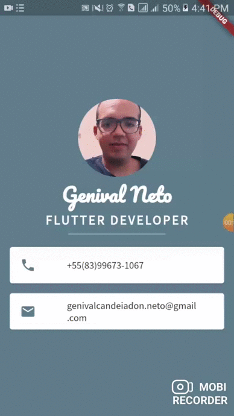

<h1 align="center"> Cartão de visita digital</h1>

</h1>
<p align="center">
   <a href="https://github.com/genivalc">
    </h1>Github</h1>
  </a>
</p>

## 📱 Gif #





## 💻 Sobre o projeto

O Cartão de Visita Digital e Interativo é uma das novas formas de disponibilizar as minha informações de forma fácil, eficiente e 100% ecológica, através do aparelho móvel.  Com  a possibilidade de inserir links de redirecionamento para o seu site ou para as suas redes sociais.


## 🛠 Tecnologias

As seguintes ferramentas foram usadas na construção do projeto:

- [Dart][dart]
- [Flutter][flutter]

### 🎲Pré-requisitos : 

## Instalação:

 * Windows: https://flutter.dev/docs/get-started/install/windows
 * macOS: https://flutter.dev/docs/get-started/install/macos
 * Linux: https://flutter.dev/docs/get-started/install/linux

### Android Studio:

 * Versão: 3.0+
 * Plugins: Flutter (automaticamente instala o plugin do Dart)
 * Mais informações: https://flutter.dev/docs/get-started/editor?tab=androidstudio

### VS Code:

 * Versão: última estável
 * Extensões: Flutter (automaticamente instala a extensão do Dart)
 * Mais informações: https://flutter.dev/docs/get-started/editor?tab=vscode

### 🧭 Rodando a aplição 

```bash
# Clone este repositório
$ git clone https://github.com/genivalc/Refei-es-Deli.git

# Acesse a pasta do projeto no seu terminal/cmd
$ cd -Despesas

 Para executar o projeto basta pressionar F5 no Vs code , ou se quiser executar o projeto na linha de comando, abra um terminal de comandos e posicione-se na pasta raiz do projeto que deseja executar e digite o comando :
 flutter run -d all

Antes de executar é bom verificar se você tem um dispositivo pronto para ser usado.

```

## 😯 Como contribuir para o projeto

1. Faça um **fork** do projeto.
2. Crie uma nova branch com as suas alterações: `git checkout -b my-feature`
3. Salve as alterações e crie uma mensagem de commit contando o que você fez: `git commit -m "feature: My new feature"`
4. Envie as suas alterações: `git push origin my-feature`
> Caso tenha alguma dúvida confira este [guia de como contribuir no GitHub](https://github.com/firstcontributions/first-contributions)

## 📝 Licença

Este projeto esta sobe a licença MIT. Veja a [LICENÇA](license) para saber mais.

Feito por Genival Neto  👋🏽 [Entre em contato!](https://www.linkedin.com/in/genival-candeia-neto/)

[vscode]: https://code.visualstudio.com/
[dart]: https://dart.dev/
[flutter]: https://flutter.dev/
